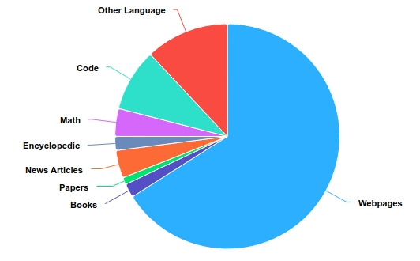

<!-- markdownlint-disable first-line-h1 -->
<!-- markdownlint-disable html -->
<div align="center">
  
</div>

<div align="center">
<h1>
  Orion-MoE8x7B
</h1>
</div>

<div align="center">

<div align="center">
     <b>🌐English</b> | <a href="https://github.com/OrionStarAI/Orion-MoE/blob/main/README_zh.md" target="_blank">🇨🇳中文</a>
</div>


</div>


# Table of Contents

- [📖 Model Introduction](#model-introduction)
- [🔗 Model Download](#model-download)
- [🔖 Model Benchmark](#model-benchmark)
- [📊 Model Inference](#model-inference)
- [📜 Declarations & License](#declarations-license)
- [🥇 Company Introduction](#company-introduction)


<a name="model-introduction"></a><br>
# 1. Model Introduction

- Orion-MoE8x7B is a pretrained foundation large language model with a sparse Mixture of Experts (MoE) architecture. The model is trained from scratch on a multilingual corpus comprising approximately 5 trillion tokens, including launguages such as Chinese, English, Japanese, Korean, and more.

- Key Features of Orion-MoE8x7B
  - The model demonstrates exceptional performance in comprehensive evaluations compared to other models of the same parameter scale.
  - The model excels in multilingual benchmarks, significantly outperforming in Japanese and Korean test sets, and also performing strong results in Arabic, German, French, and Spanish evaluations.
  - Leveraging its sparse MoE structure, the model achieves faster inference speeds compared to dense models of similar scale.

- Model Architecture 

    |Configuration      |Orion-MoE 8x7B|
    |-------------------|-------------|
    |Hidden Size        | 4096        |
    |# Layers           | 32          |
    |# Query Heads      | 32          |
    |# KV Heads         | 8           |
    |Intermediate Size  | 14592       |
    |# Experts          | 8           |
    |# Activated Experts| 2           |
    |Embedding Tying    | False       |
    |Position embedding | RoPE        |
    |seq_len            | 8192        |
    |Vocabulary Size    | 113664      |

- Training hyper-parameters
  - We use the AdamW optimizer with hyperparameters set to 𝛽1 = 0.9, 𝛽2 = 0.95, and a weight decay of 0.1.
  - Training begins with a learning rate warm-up phase over 2000 iterations, where the learning rate is linearly increased to a peak of 3e-4. Afterward, a cosine schedule is applied to gradually reduce the learning rate to 3e-5 over the course of training.
  - The model is trained using BF16/FP32 mixed precision, with a batch size of 2600, processing approximately 22 million tokens per step.

- Data Distribution
  - The training dataset is primarily composed of English, Chinese, which together account for over 75% of the total data. The remaining dataset includes other languages, programming code, mathematical data, etc. A detailed breakdown of the topic distribution is provided in the table below.
<div align="center">
  
</div>

- We are pleased to release our foundation model at this moment and will be releasing the instruction model shortly. Stay tuned!

<a name="model-download"></a><br>
# 2. Model Download

Model release and download links are provided in the table below:

| Model Name | HuggingFace Download Links | ModelScope Download Links |
|------------|----------------------------|---------------------------|
| ⚾Orion-MoE8x7B | [Orion-MoE8x7B](https://huggingface.co/OrionStarAI/Orion-MoE8x7B) | [Orion-MoE8x7B](https://modelscope.cn/models/OrionStarAI/Orion-MoE8x7B-Base/summary) |


<a name="model-benchmark"></a><br>
# 3. Model Evaluation

### 3.1. LLM evaluation results on examination and professional knowledge


|TestSet|Mixtral 8x7B|Qwen1.5-32b|Qwen2.5-32b|Orion 14B |Qwen2-57B-A14 <th> Orion MoE8x7B</th>
| -------------- | ---- | ---- | ---- | ---- | ---- 
| MMLU           | 70.4 | 73.4 | 82.9 | 69.9  | 76.5  <td class="orion">**85.9**</td> 
| MMLU Pro       | 38.5 | 45.3 | 58.0 | 34.0  |48.6  <td class="orion">**58.3**</td> 
| CEval          | 54.1 | 83.5 | 87.7 | 72.8 | 87.7  <td class="orion">**89.7**</td> 
| CMMLU          | 53.2 | 82.3 | 89.0 | 70.6 | 88.5  <td class="orion">**89.2**</td> 
| ARC_c          | 85.1 | 90.2 | **94.2** | 79.7 |91.5  <td class="orion">91.9</td> 
| HellaSwag      | 81.9 | 82.0 | 82.5 | 78.5 | 85.2  <td class="orion">**89.2**</td> 
| LAMBADA        | 76.8 | 73.7 | 75.4 | 78.8 | 72.6  <td class="orion">**79.7**</td> 
| BBH            | 50.9 | 57.3 | **67.7** | 50.4 | 55.1  <td class="orion">55.8</td> 
| MuSR           | 43.2 | 42.7 | 49.8 | 43.6 | 39.0   <td class="orion">**49.9**</td> 
| PIQA           | 83.4 | 82.2 | 80.1 | 79.5 | 81.9  <td class="orion">**87.3**</td> 
| CommonSenseQA  | 69.6 | **74.7** | 73.0 | 66.9 | 69.9  <td class="orion">73.1</td> 
| IFEval         | 24.2 | 33.0 | **41.6** | 29.1 | 31.2  <td class="orion">30.1</td> 
| GQPA           | 30.9 | 33.5 | 49.5 | 28.5 | 32.6  <td class="orion">**52.2**</td> 
| HumanEval      | 33.5 | 36.0 | **47.0** | 20.1 | 53.0  <td class="orion">44.5</td> 

### 3.2. Comparison of LLM performances on Japanese testsets
|Model        <th>Average</th>|JSQuAD|JCommonSenseQA|JNLI|MARC-ja|JAQKET v2|PAWS-ja|
|-------------|-------|-------|---------------|-----|-------|---------|
|Mixtral-8x7B <td class="avg">69.8</td> |89.0 |78.7 |32.1 |95.4 |78.9 |44.5 |
|Qwen1.5-32B  <td class="avg">74.7</td> |89.9 |84.5 |51.0 |97.1 |82.1 |43.8 |
|Qwen2.5-32B  <td class="avg">80.7</td> |89.1 |93.8 |72.1 |**97.9** |**89.3** |42.2 |
|Orion-14B    <td class="avg">74.2</td> |74.2 |88.2 |72.8 |94.1 |66.2 |49.9 |
|Orion-MoE8x7B <td class="avg">**82.9**</td> | **91.8** | 90.4 | **90.5** | 96.4 | 81.2 | **47.4** |

### 3.3. Comparison of LLM performances on Korean testsets
|Model <th>Average</th>|HAE-RAE|KoBEST BoolQ|KoBEST COPA|KoBEST HellaSwag|KoBEST SentiNeg|KoBEST WiC|PAWS-ko|
|-----|-------|-------|------------|-----------|----------------|---------------|----------| 
|Mixtral-8x7B   <td class="avg">60.7</td> |53.2 |78.6 |66.2 |56.6 |77.1 |49.4 |44.1 |
|Qwen1.5-32B    <td class="avg">58.6</td> |46.4 |76.3 |60.4 |53.0 |78.3 |52.1 |43.4 |
|Qwen2.5-32B    <td class="avg">71.4</td> |**70.7** |80.3 |76.7 |**61.2** |96.5 |**77.2** |37.1 |
|Orion-14B      <td class="avg">67.7</td> |69.7 |80.6 |77.1 |58.2 |92.4 |51.2 |44.6 |
|Orion-MoE8x7B  <td class="avg">**72.0**</td> | 65.2 | **85.4** | **80.4** | 56.0 | **97.0** | 73.6 | **46.4** |

### 3.4. Comparison of LLM performances on Arabic, German, French, and Spanish testsets
| Language | Spanish |  | French |  | German |  | Arabic |  |
|----|----|----|----|----|----|----|----|----|
|**Model**|**HellaSwag**|**ARC**|**HellaSwag**|**ARC**|**HellaSwag**|**ARC**|**HellaSwag**|**ARC**|
|Mixtral-8x7B |74.3 |54.8 |73.9 |55.9 |69.2 |52.4 |47.9 |36.3 |
|Qwen1.5-32B  |70.5 |55.1 |68.9 |56.0 |63.8 |50.8 |50.1 |40.0 |
|Qwen2.5-32B  |75.0 |65.3 |74.2 |62.7 |69.8 |61.8 |59.8 |52.9 |
|Orion-14B    |62.0 |44.6 |60.2 |42.3 |54.7 |38.9 |42.3 |33.9  <tr><td> Orion-MoE8x7B</td>  <td class="orion">**87.4**</td>  <td class="orion">**70.1**</td>  <td class="orion">**85.6**</td>  <td class="orion">**68.8**</td>  <td class="orion">**80.6**</td>  <td class="orion">**63.5**</td>  <td class="orion">**69.4**</td>  <td class="orion">**54.3</td>** </tr>

### 3.5. Leakage Detection Benchmark
When the pre-training data of a large language model contains content from a specific dataset, the model’s performance on that dataset may be artificially enhanced, leading to inaccurate performance evaluations. To address this issue, researchers from the Shenzhen Institute of Advanced Technology, Chinese Academy of Sciences, and other institutions have proposed a simple and effective method for detecting data leakage. This method leverages the interchangeable nature of multiple-choice options by shuffling the options in the original dataset to generate derived data. The log-probability distribution of the derived dataset is then computed using the model to detect whether the original dataset has been leaked.

We conducted data leakage detection experiments on three benchmark datasets: MMLU, CMMLU, and C-Eval.<br>
More details can be found in the paper: https://web3.arxiv.org/pdf/2409.01790.<br>
Test code: https://github.com/nishiwen1214/Benchmark-leakage-detection.

|Threshold 0.2|Qwen2.5 32B|Qwen1.5 32B| Orion MoE8x7B |Orion 14B|Mixtral 8x7B|
|------|------|------|------|------|------|
|MMLU  | 0.30 | 0.27 | 0.22 | 0.28 | 0.25 |
|CEval | 0.39 | 0.38 | 0.27 | 0.26 | 0.26 |
|CMMLU | 0.38 | 0.39 | 0.23 | 0.27 | 0.22 |

### 3.6. Inference speed
Setup inference server on 8x Nvidia RTX3090， and get results from client in unit of 'tokens per second'.
|Models | 8x3090 1 concurrent | 8x3090 4 concurrent | 4xA100 1 concurrent | 4xA100 4 concurrent|
|---------|--------|-------|--------|-------|
|Qwen32   | 52.93  | 46.06 | 62.43  | 56.81  <tr><td>Orion-MoE</td>  <td class="orion">**102.77**</td>  <td class="orion">**54.61**</td>  <td class="orion">**107.76**</td>  <td class="orion">**61.83**</td> </tr>

<br>
We also tested on a 4x A100, comparing inference speeds based on different input lengths (tokens), get results from client in unit of 'tokens per second'.

| Input | 4k | 8k | 12k | 16k | 32k | 64k |
|---------|-------|-------|-------|-------|-------|-------|
|Qwen32   | 53.99 | 47.59 | 25.98 | 24.35 | 18.64 | 11.86 <tr><td>Orion-MoE</td>  <td class="orion">**90.86**</td>  <td class="orion">**54.40**</td>  <td class="orion">**31.08**</td>  <td class="orion">**29.04**</td>  <td class="orion">**22.69**</td>  <td class="orion">**14.51**</td> </tr>

<a name="model-inference"></a><br>
# 4. Model Inference

Model weights, source code, and configuration needed for inference are published on Hugging Face, and the download link
is available in the table at the beginning of this document. We demonstrate various inference methods here, and the
program will automatically download the necessary resources from Hugging Face.

## 4.1. Python Code

```python
import torch
from transformers import AutoModelForCausalLM, AutoTokenizer
from transformers.generation.utils import GenerationConfig

tokenizer = AutoTokenizer.from_pretrained("OrionStarAI/Orion-MoE8x7B",
                                          use_fast=False,
                                          trust_remote_code=True)
model = AutoModelForCausalLM.from_pretrained("OrionStarAI/Orion-MoE8x7B",
                                             device_map="auto",
                                             torch_dtype=torch.bfloat16,
                                             trust_remote_code=True)

model.generation_config = GenerationConfig.from_pretrained("OrionStarAI/Orion-MoE8x7B")
messages = [{"role": "user", "content": "Hello, what is your name? "}]
response = model.chat(tokenizer, messages, streaming=False)
print(response)

```

In the above Python code, the model is loaded with `device_map='auto'` to utilize all available GPUs. To specify the
device, you can use something like `export CUDA_VISIBLE_DEVICES=0,1,2,3,4,5,6,7` (using GPUs 0,1,2,3,4,5,6,7).

## 4.2. Direct Script Inference

```shell

# foundation model
CUDA_VISIBLE_DEVICES=0,1,2,3,4,5,6,7 python demo/text_generation_base.py --model OrionStarAI/Orion-MoE8x7B --tokenizer OrionStarAI/Orion-MoE8x7B --prompt hello

```
## 4.3. vLLM Inference Service
Download project(https://github.com/OrionStarAI/vllm_server), follow the instructions to build up the vLLM service docker image.
```shell
git clone git@github.com:OrionStarAI/vllm_server.git
cd vllm_server
docker build -t vllm_server:0.0.0.0 -f Dockerfile .
```
Start docker service
```shell
docker run --gpus all -it -p 9999:9999 -v $(pwd)/logs:/workspace/logs:rw -v $HOME/Downloads:/workspace/models -e CUDA_VISIBLE_DEVICES=0,1,2,3,4,5,6,7 -e MODEL_DIR=Orion-MoE8x7B -e MODEL_NAME=orion-moe vllm_server:0.0.0.0
```
Run inference
```shell
curl http://0.0.0.0:9999/v1/chat/completions -H "Content-Type: application/json" -d '{"model": "orion-moe","temperature": 0.2,"stream": false, "messages": [{"role": "user", "content":"Which company developed you as an AI agent?"}]}'
```


<a name="declarations-license"></a><br>
# 5. Declarations, License

## 5.1. Declarations

We strongly urge all users not to use the Orion-MoE8x7B model for any activities that may harm national or social security or violate the law.
Additionally, we request users not to use the Orion-MoE8x7B model for internet services without proper security review and filing.
We hope all users abide by this principle to ensure that technological development takes place in a regulated and legal environment.
We have done our best to ensure the compliance of the data used in the model training process. However, despite our
significant efforts, unforeseen issues may still arise due to the complexity of the model and data. Therefore, if any
problems arise due to the use of the Orion-MoE8x7B open-source model, including but not limited to data security
issues, public opinion risks, or any risks and issues arising from the model being misled, abused, disseminated, or
improperly utilized, we will not assume any responsibility.

## 5.2. License

Community use of the Orion-MoE8x7B series models
- For code, please comply with  [Apache License Version 2.0](./LICENSE)<br>
- For model, please comply with [【Orion Series】 Models Community License Agreement](./ModelsCommunityLicenseAgreement)


<a name="company-introduction"></a><br>
# 6. Company Introduction

OrionStar is a leading global service robot solutions company, founded in September 2016. OrionStar is dedicated to
using artificial intelligence technology to create the next generation of revolutionary robots, allowing people to break
free from repetitive physical labor and making human work and life more intelligent and enjoyable. Through technology,
OrionStar aims to make society and the world a better place.

OrionStar possesses fully self-developed end-to-end artificial intelligence technologies, such as voice interaction and
visual navigation. It integrates product development capabilities and technological application capabilities. Based on
the Orion robotic arm platform, it has launched products such as OrionStar AI Robot Greeting, AI Robot Greeting Mini,
Lucki, Coffee Master, and established the open platform OrionOS for Orion robots. Following the philosophy of "Born for
Truly Useful Robots", OrionStar empowers more people through AI technology.

**The core strengths of OrionStar lies in possessing end-to-end AI application capabilities,** including big data preprocessing, large model pretraining, fine-tuning, prompt engineering, agent, etc.  With comprehensive end-to-end model training capabilities, including systematic data processing workflows and the parallel model training capability of hundreds of GPUs, it has been successfully applied in various industry scenarios such as government affairs, cloud services, international e-commerce, and fast-moving consumer goods.

Companies with demands for deploying large-scale model applications are welcome to contact us.<br>
**Enquiry Hotline: 400-898-7779**<br>
**E-mail: ai@orionstar.com**<br>
**Discord Link: https://discord.gg/zumjDWgdAs**


<div align="center">
  
</div>
